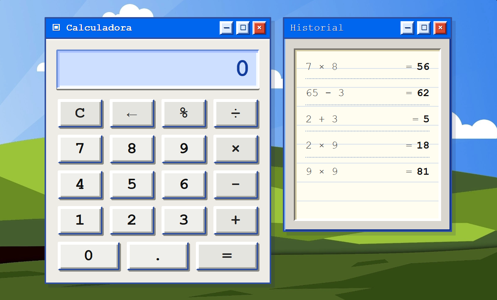
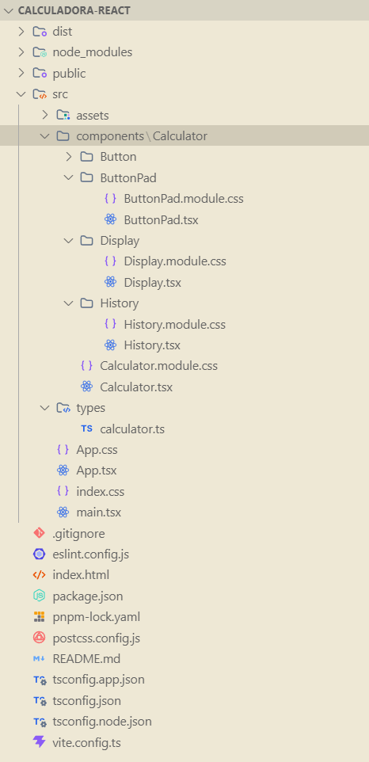

# Actividad 2 - Calculadora con React, TypeScript y TailwindCSS

Proyecto desarrollado con **React + Vite + TypeScript + TailwindCSS** para la materia de Programación para Dispositivos Móviles II.

## Datos del estudiante

**Nombre:** Jorge Daniel Choque Ferrufino  
**Carrera:** Sistemas Informáticos  
**Materia:** Programación para Dispositivos Móviles II  

## Descripción de la práctica

Esta práctica consiste en el desarrollo de una calculadora funcional utilizando React con TypeScript.
El proyecto aplica una arquitectura basada en componentes, uso de hooks como `useState` y `useEffect`, validaciones de entrada y estilos personalizados con TailwindCSS y CSS Modules.

## Captura de la calculadora



## Tecnologías utilizadas

* React
* Vite
* TypeScript
* TailwindCSS V4
* CSS Modules
* pnpm

## Funcionalidades implementadas

* Suma
* Resta
* Multiplicación
* División
* Botón para limpiar la calculadora
* Botón de igual para calcular el resultado
* Botón de retroceso
* Botón de porcentaje
* Validación de división por cero
* Límite máximo de dígitos en pantalla
* Prevención de múltiples puntos decimales
* Historial de operaciones
* Persistencia del historial con `localStorage`
* Diseño responsive básico

## Estructura principal del proyecto



## Conceptos aplicados

### Componentes

El proyecto está dividido en componentes reutilizables:

* `Calculator`: componente principal que maneja la lógica de la calculadora.
* `Display`: muestra el valor actual.
* `ButtonPad`: organiza los botones.
* `Button`: componente reutilizable para cada botón.
* `History`: muestra las últimas operaciones realizadas.

### useState

Se utiliza `useState` para manejar el estado de la calculadora, como el valor mostrado en pantalla, el operador actual, el valor anterior y el historial de operaciones.

### useEffect

Se utiliza `useEffect` para controlar efectos secundarios, como validaciones y persistencia del historial en `localStorage`.

### TypeScript

Se definieron tipos para los operadores, el estado de la calculadora y las operaciones guardadas en el historial.

## Instalación del proyecto

```bash
pnpm install
```

## Ejecutar el proyecto

```bash
pnpm dev
```

## Generar build de producción

```bash
pnpm build
```

## Pruebas realizadas

| Prueba                        | Resultado esperado               |
| ----------------------------- | -------------------------------- |
| `5 + 3`                       | `8`                              |
| `9 - 4`                       | `5`                              |
| `6 × 7`                       | `42`                             |
| `8 ÷ 2`                       | `4`                              |
| `8 ÷ 0`                       | Muestra error                    |
| Ingresar más de 12 dígitos    | Limita la entrada                |
| Ingresar dos puntos decimales | No permite duplicar el punto     |
| Usar botón de retroceso       | Borra el último dígito           |
| Usar porcentaje               | Convierte el número a porcentaje |
| Realizar varias operaciones   | Se guardan en el historial       |


